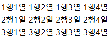
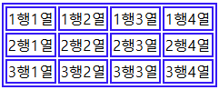
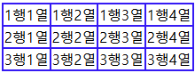
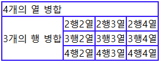

# 🌟 테이블(table) CSS 속성 쉽게 이해하기

> `box-shadow`, `linear-gradient` 등등 처음에 이해하기 어려운 CSS 속성들이 있습니다.<br/>
> 하지만 속성 값을 확인하면 이해하기 쉽고, 실습 때 확인한 것처럼 도와주는 사이트도 있습니다.<br/>
> 그래서 커리큘럼 3~4일차에 있는 table 속성에 대해서 설명해보겠습니다.

## ✅ (CSS 속성을 적용하지 않은) table을 만들기

테이블을 만들기 위해서는 다음 4가지 태그를 알아야 합니다.

1. `<table>` 태그 : 표를 만드는 태그
2. `<tr>` 태그 : 테이블의 행(row)을 만드는 태그
3. `<td>` 태그 : 테이블의 셀(cell)을 만드는 태그
4. `<th>` 태그 : 테이블의 제목열을 만드는 태그(볼드체로 적용됨)

## ✅ (CSS 속성을 적용하지 않은) table 예시

```html
<table>
  <tr>
    <td>1행1열</td>
    <td>1행2열</td>
    <td>1행3열</td>
    <td>1행4열</td>
  </tr>

  <tr>
    <td>2행1열</td>
    <td>2행2열</td>
    <td>2행3열</td>
    <td>2행4열</td>
  </tr>

  <tr>
    <td>3행1열</td>
    <td>3행2열</td>
    <td>3행3열</td>
    <td>3행4열</td>
  </tr>
</table>
```



테이블은 만들어 지지만 우리가 알고있는 테두리가 있는 테이블이 아니므로 이젠 속성값을 부여해서 테이블로 꾸며줘야합니다.

## ✅ 꼭 알아야하는 table CSS 속성

> 모든 속성은 외우기보단 키워드를 알고있다가 사용하기 전에 떠오르고 mdn, 사용 예시 등을 검색해보면서 손에 익혀 나가야합니다.<br/>
> 무작정 외운다고해서 외워지지도 않고, 오히려 거부감이 생길꺼에요.

### 1️⃣ border 속성 (테두리 만들기)

html 실습할 때 테두리를 부여해보신 적이 있습니다. 똑같이 테이블 속성에도 부여해주면 됩니다.

```css
table,
th,
td {
  border: 2px solid blue;
}
```



테두리가 생겼지만 테두리가 두줄씩 나타나는걸 확인할 수 있습니다. <br/>

**✅ 왜 그럴까요??** <br/>

각 셀이 자신만의 테두리를 가지고 있어, 이중선처럼 보입니다. <br/>
이를 해결하려면 border-collapse 속성을 추가해야 합니다.

### 2️⃣ border-collapse 속성 (테두리 합치기)

```css
table,
th,
td {
  border: 2px solid blue;
}
table {
  border-collapse: collapse;
}
```



✅ border-collapse: collapse;란?

- 테이블의 개별 셀 테두리를 하나로 합쳐, 이중선이 사라지도록 합니다.
- 별도로 설정하지 않으면 `border-collapse: separate;`가 기본값으로 적용됩니다.

앞으로 표를 만들 때마다 90% 이상은 해당 속성을 쓰고 시작할꺼에요.

### 3️⃣ colspan과 rowspan 속성 (셀 병합)

> table에서 width, height, text-align 등의 속성도 중요하지만, 특히 셀을 합치는 colspan과 rowspan 속성은 꼭 알아야 합니다.

✅ colspan (가로 병합)

- column span의 줄임말로, 여러 개의 열(가로줄)을 병합합니다.

✅ rowspan (세로 병합)

- row span의 줄임말로, 여러 개의 행(세로줄)을 병합합니다.

```html
<table>
  <tr>
    <td colspan="4">4개의 열 병합</td>
    <!-- <td>1행2열</td>
    <td>1행3열</td>
    <td>1행4열</td> -->
  </tr>

  <tr>
    <td rowspan="3">3개의 행 병합</td>
    <td>2행2열</td>
    <td>2행3열</td>
    <td>2행4열</td>
  </tr>

  <tr>
    <!-- <td>3행1열</td> -->
    <td>3행2열</td>
    <td>3행3열</td>
    <td>3행4열</td>
  </tr>

  <tr>
    <!-- <td>4행1열</td> -->
    <td>4행2열</td>
    <td>4행3열</td>
    <td>4행4열</td>
  </tr>
</table>
```



✅ `colspan="4"` → 한 행에서 4개의 열을 병합 <br/>
✅ `rowspan="3"` → 한 열에서 3개의 행을 병합

**💡 주의할 점**:

- colspan을 사용하면 기존의 가로 셀들을 덮어쓰기 때문에, 병합된 셀의 개수만큼 <td>를 삭제해야 합니다.
- rowspan을 사용할 경우, 아래쪽 셀을 덮어쓰기 때문에 해당 <td>도 삭제해야 합니다.

## ✅ 마무리

💡 정리하면? <br/>
1️. border 속성으로 테두리를 만든다.<br/>
2️. border-collapse 속성을 사용해 이중선을 없앤다.<br/>
3️. colspan과 rowspan을 이용해 셀을 병합한다.
