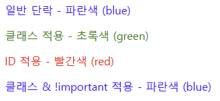
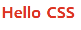

# 🎨 CSS의 Cascading(캐스케이딩)이란?

CSS에서 `Cascading(캐스케이딩)`이란 **여러 스타일 규칙이 한 요소에 적용될 때, 어떤 스타일이 최종적으로 적용될지를 결정하는 원리**입니다.<br/>
즉, 여러 개의 스타일 규칙이 충돌할 경우, **우선순위에 따라 어떤 스타일이 적용될지를 결정하는 메커니즘**입니다.

## 📌 CSS 스타일 적용 우선순위 순서도

```plaintext
📌 1순위: !important (가장 강력한 우선순위)
  ⬇
📌 2순위: 명시도(Specificity)
  ⬇
📌 3순위: 소스 코드 순서(Source Order)
```

## 1️⃣ 중요도(Importance)

> `!important` 속성이 있는 스타일이 최우선으로 적용됩니다.

### ✅ 예시

```html
<!-- 예시를 위한 html 코드 -->
<p>일반 단락 - 파란색 (blue)</p>
<p class="text">클래스 적용 - 초록색 (green)</p>
<p id="special">ID 적용 - 빨간색 (red)</p>
<p id="special" class="force-blue">ID + !important - 파란색 (blue)</p>
```

```css
/* 예시를 위한 css 코드 */
/* 1. 기본 스타일 */
p {
  color: blue;
}

/* 2. 클래스 스타일 */
.text {
  color: green;
}

/* 3. ID 스타일 */
#special {
  color: red;
}

/* 4. !important 사용 */
.force-blue {
  color: blue !important;
}
```

### ✅ 예상 결과:

| 스타일 적용 대상              | 적용된 스타일                                                    |
| ----------------------------- | ---------------------------------------------------------------- |
| `<p>`                         | 기본적으로 **파란색(blue)** 적용                                 |
| `<p class="text">`            | `.text` 클래스 때문에 **초록색(green)** 적용                     |
| `<p id="special">`            | `#special` ID 때문에 **빨간색(red)** 적용                        |
| `<p class="text force-blue">` | `.force-blue`에 `!important`가 있기 때문에 **파란색(blue)** 적용 |



> 2순위에 나올 명시도에 의해 id 선택자가 우선순위가 calss 선택자보다 우선순위가 높지만 `!important`를 사용해서 파란색이 적용됐습니다.

## 2️⃣ 명시도(Specificity, 우선순위 점수)

> 선택자의 명확한 정도에 따라 점수가 부여되며, 점수가 높은 스타일이 적용됩니다.

### ✅ 우선순위

| 선택자 유형                                              | 우선순위 값 |
| -------------------------------------------------------- | ----------- |
| 인라인 스타일 (`style=""`)                               | **1000**    |
| ID 선택자 (`#id`)                                        | **100**     |
| 클래스, 속성, 가상 선택자 (`.class`, `[attr]`, `:hover`) | **10**      |
| 태그 선택자 (`div`, `p`, `h1` 등)                        | **1**       |
| 전체 선택자 (`*`), 상속                                  | **0**       |

### ✅ 예시

```html
<h1 id="main-title" class="title">Hello CSS</h1>
```

```css
h1 {
  color: blue;
} /* 우선순위: 1 */
.title {
  color: green;
} /* 우선순위: 10 */
#main-title {
  color: red;
} /* 우선순위: 100 */
```



`<h1>`와 `class 선택자`에도 속성 값을 부여했지만 `id 선택자`의 우선 순위가 높아 예시처럼 빨간색으로 적용됐습니다.

## 3️⃣ 선언 순서 (소스 코드의 위치)

> 같은 우선순위를 가진 스타일이 충돌할 경우, **나중에 선언된 스타일이 적용**됩니다.

### ✅ 예시

```css
p {
  color: blue;
}
p {
  color: green;
}
```

### ✅ 결과

**녹색(green)이 적용됨** (나중에 선언된 스타일이 우선)

## ✅ Cascading 정리

### 💡 CSS의 스타일 적용 우선순위:

1. `!important`가 있는 스타일이 최우선
2. 인라인 스타일 (`style=""`)이 적용
3. `ID 선택자` > `클래스 선택자` > `태그 선택자` 순으로 우선
4. 같은 우선순위라면 나중에 선언된 스타일이 적용
