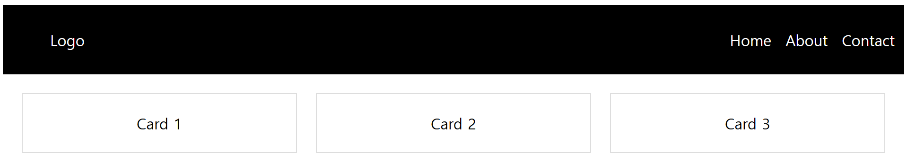
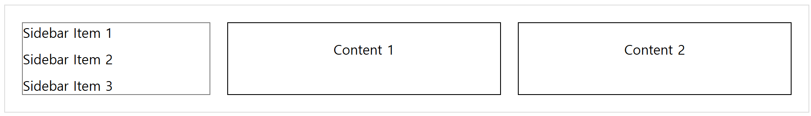

# 🚀 Flexbox vs Grid: 차이점과 혼합 사용

> **언제 Flexbox를 쓰고 언제 Grid를 써야 할까요?** 🤔<br/>
> 두 개념의 차이를 이해하고, 각각의 실용적인 사용 사례를 중심으로 정리해보겠습니다.

## ✅ Flexbox vs Grid: 차이점 비교

| 구분          | Flexbox                                            | Grid                                        |
| ------------- | -------------------------------------------------- | ------------------------------------------- |
| **1D / 2D**   | **1D 레이아웃** (한 방향 정렬)                     | **2D 레이아웃** (가로 + 세로 조정 가능)     |
| **배치 방식** | 주축(main axis)과 교차축(cross axis)을 이용한 정렬 | 행(row)과 열(column)을 지정하여 배치        |
| **유연성**    | 컨테이너 크기에 맞춰 아이템 크기 자동 조정         | 행과 열을 명확하게 정의하고 배치            |
| **사용 예시** | 네비게이션 바, 버튼 정렬, 리스트 레이아웃          | 전체 페이지 레이아웃, 대시보드, 카드 디자인 |

### 📌 **언제 Flexbox를 쓰고 언제 Grid를 써야 할까?**

- **수평 정렬, 수직 정렬만 필요할 때** → `Flexbox`가 적합
- **격자형 레이아웃을 만들어야 할 때** → `Grid`가 적합
- **복합적인 레이아웃이 필요할 때** → 두 가지를 혼합 사용

## 🔥 Flexbox & Grid 혼합 사용하기

Flexbox와 Grid를 함께 사용하는 것은, 웹 페이지의 큰 구조를 Grid로 잡고, 그 안의 세부 요소들을 Flexbox로 정렬하는 방식입니다. <br/>
이렇게 하면 2차원 레이아웃과 유연한 정렬을 활용할 수 있습니다.

### 🎯 **예제: 네비게이션 바 + 카드 레이아웃**

이 예제에서는 **네비게이션 바**는 `Flexbox`로 정렬하고, **메인 콘텐츠**는 `Grid`를 활용하여 배치합니다.

```css
/* 네비게이션 바 (Flexbox) */
.nav {
  display: flex;
  justify-content: space-between;
  padding: 10px;
  background: black;
  color: white;
}

/* 네비게이션 내부 요소 */
.nav ul {
  display: flex;
  list-style: none;
  gap: 15px;
}

/* 카드 레이아웃 (Grid) */
.container {
  display: grid;
  grid-template-columns: repeat(3, 1fr);
  gap: 20px;
  padding: 20px;
}

.card {
  background: white;
  padding: 20px;
  text-align: center;
  border: 1px solid #ddd;
}
```

✅ **활용 방법**

- **네비게이션 바** → `Flexbox`를 사용하여 가로 정렬
- **메인 콘텐츠** → `Grid`를 사용하여 카드형 레이아웃 구성

✅ **예시 화면**



### 🎯 **예제: 반응형 레이아웃 (Flex + Grid 혼합)**

```css
.container {
  display: grid;
  grid-template-columns: 1fr 3fr;
  gap: 20px;
  border: 1px solid #ddd;
  padding: 20px;
}

.sidebar {
  display: flex;
  flex-direction: column;
  gap: 10px;
  border: 1px solid grey;
}

.content {
  display: grid;
  grid-template-columns: repeat(2, 1fr);
  gap: 20px;
}
.card {
  background: white;
  padding: 20px;
  text-align: center;
  border: 1px solid #000000;
}
```

✅ **활용 방법**

- **사이드바** → `Flexbox`를 사용하여 세로 정렬
- **메인 콘텐츠** → `Grid`를 사용하여 2열 구조

✅ **예시 화면**



## ✅ 마무리 정리

- **Flexbox는 1D(가로/세로) 정렬에 적합**
- **Grid는 2D(행+열) 레이아웃에 강함**
- **실무에서는 둘을 혼합하여 사용하는 것이 일반적**

### 🚀 언제 어떤 걸 써야 할까?

- **수직 or 수평 정렬만 필요하다?** → Flexbox
- **그리드 레이아웃을 짜야 한다?** → Grid
- **둘 다 필요하다?** → 혼합 사용 💡
