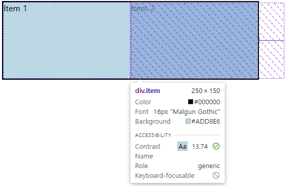
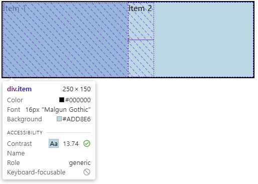

# 🎨 `flex-basis`와 `width`의 차이

> 오늘 팀 미팅 자료 주제를 고민하던 중, 2팀 재현님의 질문을 보고 이 주제를 선택하게 되었습니다.

## 🎯 `width`와 `flex-basis`, 정말 다른 걸까?

> 사실 flex-basis를 잘 활용해본 적이 없어서 직접 실습하면서 정리해보았습니다.<br/>
> 따라서 일부 내용이 부정확할 수 있으며, 재현님의 질문에 대한 답변을 확인 후 틀린 점이 있다면 수정하도록 하겠습니다.

실습을 진행하면서 알게 된 점은, **부모 태그**에 `display: flex;`가 선언되어 있는 경우 `width`와 `flex-basis`는 거의 동일하게 동작한다는 것입니다.<br/>
따라서 두 속성의 차이를 이해하려면 가장 먼저 부모 요소의 `display` 속성을 확인해야 합니다.

## 📌 부모 태그가 `display: flex;`인지 여부에 따른 비교

| 부모의 `display` 속성              | `width` vs `flex-basis` 동작 방식                |
| ---------------------------------- | ------------------------------------------------ |
| `display: block;` (일반 블록 요소) | `flex-basis`는 의미 없음 → `width`가 크기를 결정 |
| `display: flex;` (Flex 컨테이너)   | `flex-basis`가 `width`보다 우선 적용됨           |

### ✅ 정리

1.  부모 요소가 `display: flex;`가 아니라면

    - `flex-basis`는 **무시됨** → `width`가 크기를 결정

2.  부모 요소가 `display: flex;`라면

    - `flex-basis`가 설정되어 있으면 `width`보다 **우선 적용됨**
    - `flex-basis`가 설정되지 않았다면 → `width`가 적용됨
    - `flex-grow`, `flex-shrink` 값에 따라 크기가 변동될 수도 있음

> 해당 설명에 대한 실습은 스프린트 강의 내에 더욱 자세하게 나와있어서 배제하도록 하겠습니다.

## 📌 `display: flex;`일 때 `width`와 `flex-basis`의 차이

> 재현님의 첫 번째 의문을 해석했을 때, <br/> **"자식 태그에 `flex-basis`가 아닌 `width`를 사용했을 때, 왜 똑같이 적용되는 걸까?"** <br/>
> 라는 질문으로 이해했습니다.

### ✅ 예제 코드

```html
<div class="container">
  <div class="item">Item 1</div>
  <div class="item">Item 2</div>
</div>
```

```css
.container {
  display: flex;
  width: 500px;
  height: 150px;
  border: 2px solid black;
}

.item {
  flex-basis: 300px; /* 1. flex-basis를 사용한 경우, */
  /* width: 300px;      2. width를 사용한 경우, */
  background: lightblue;
  border: 1px dashed blue;
}
```

### 1️⃣ `flex-basis`로 값을 부여한 경우

`flex-basis: 300px;`을 설정하면, 부모 태그(컨테이너)의 크기를 초과하지 않는 범위에서 적용됩니다.<br/>
즉, `flex-basis` 값이 컨테이너 크기보다 크다면 `flex-shrink` 속성에 의해 조정됩니다.



### 2️⃣ `width`로 값을 부여한 경우



저희가 배운 것에 의하면 `width` 값을 설정하면 부모 태그(컨테이너)의 크기와 상관없이 해당 요소의 너비가 고정되어야합니다.<br/>
하지만 두 결과가 같은 것을 볼 수 있습니다.<br/>

이유는 flex-basis의 속성 값입니다.

## 📌 `flex-basis`를 사용하지 않고 `width`를 지정하면?

```css
.item {
  width: 300px;
}
```

위와 같이 `width`만 설정하면, **기본적으로** `flex-basis: auto;`가 적용됩니다.<br/>
즉, `flex-basis` 값이 설정되지 않은 경우 `auto`로 동작하며,<br/>
이때 `width`의 값이 `flex-basis`로 사용됩니다.<br/>
(`flex-basis`가 `width`보다 우선 적용됨으로 첫 번째 결과랑 같은 결과가 나타납니다.)

```css
.item {
  flex-basis: auto; /* 기본값 */
  width: 300px; /* flex-basis가 없으면 width를 사용 */
}
```

## 🚀 최종 정리

✔️ 부모 요소가 `display: flex;`인지 여부에 따라 `width`와 `flex-basis`의 동작 방식이 다름<br/>
✔️ 부모가 `display: flex;`이면 `flex-basis`가 `width`보다 우선 적용됨<br/>
✔️ `flex-basis: auto;`이면 `width` 값을 가져다 씀

### ✅ 참고자료

[이번에야말로 CSS Flex를 익혀보자](https://studiomeal.com/archives/197) <br/>
[flex-basis - Mozilla](https://developer.mozilla.org/ko/docs/Web/CSS/flex-basis)<br/>
